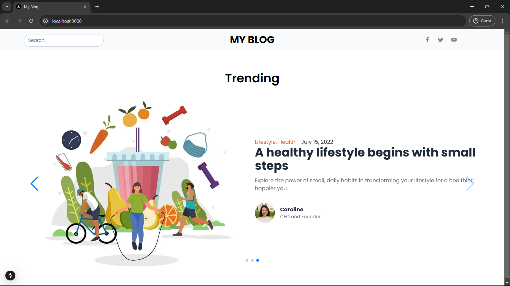
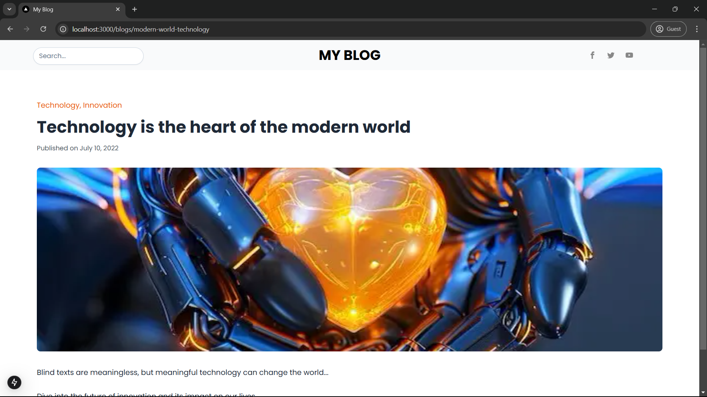

# Simple Blog Application

A modern and dynamic blog application built with **Next.js**. This project includes features such as a trending slider, dynamic blog pages, and a reusable layout system, all designed for ease of navigation and scalability.

---

## Features

- **Dynamic Routing**: Easily navigate to individual blog posts.
- **Trending Slider**: Displays top blog posts with auto-scroll functionality.
- **Reusable Layouts**: Consistent design using shared headers, footers, and main content layouts.
- **SEO-Friendly**: Clean URLs for better search engine optimization.
- **Responsive Design**: Optimized for all screen sizes using Tailwind CSS.
- **Image Optimization**: Fast-loading images using the `Image` component from Next.js.

---

## Installation

1. Clone the repository:
   ```bash
   git clone https://github.com/your-username/your-repo.git
   ```

2. Navigate to the project directory:
    ```bash
    cd <your-repo-name>
    ```

3. Install the dependencies:
    ```bash
    npm install
    ```

4. Start the development server:
    ```bash
    npm run dev
    ```

5. Open your browser and visit: ```http://localhost:3000```

## Repository Structure
The repository is structured as follows:
```bash
src/
├── app/
│   ├── blogs/[slug]/         # Dynamic blog pages
│   ├── layout.js             # Root layout component
│   └── page.js               # Homepage with trending slider
├── components/
│   ├── _child/               # Child components (e.g., Author)
│   ├── Footer.jsx            # Footer section
│   ├── Header.jsx            # Header section
│   ├── Layout.jsx            # Reusable layout component
│   └── Section1.jsx          # Trending slider section
├── public/images/            # Image assets for the application
├── styles/
│   └── globals.css           # Global CSS styles
```

## ScreenShots:

